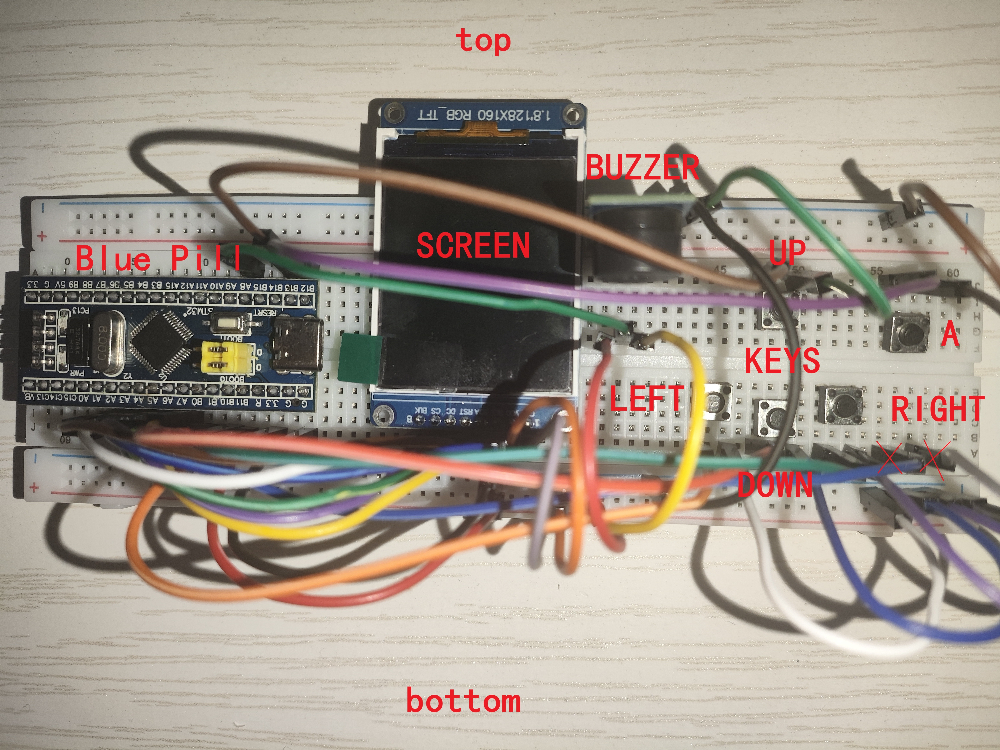
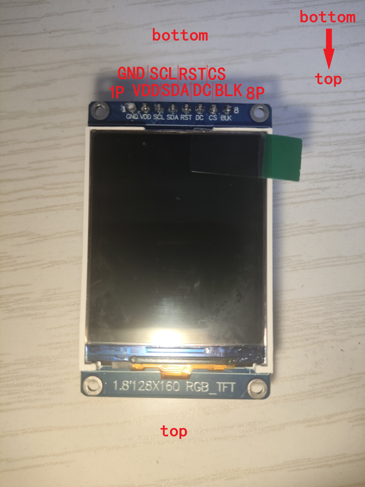
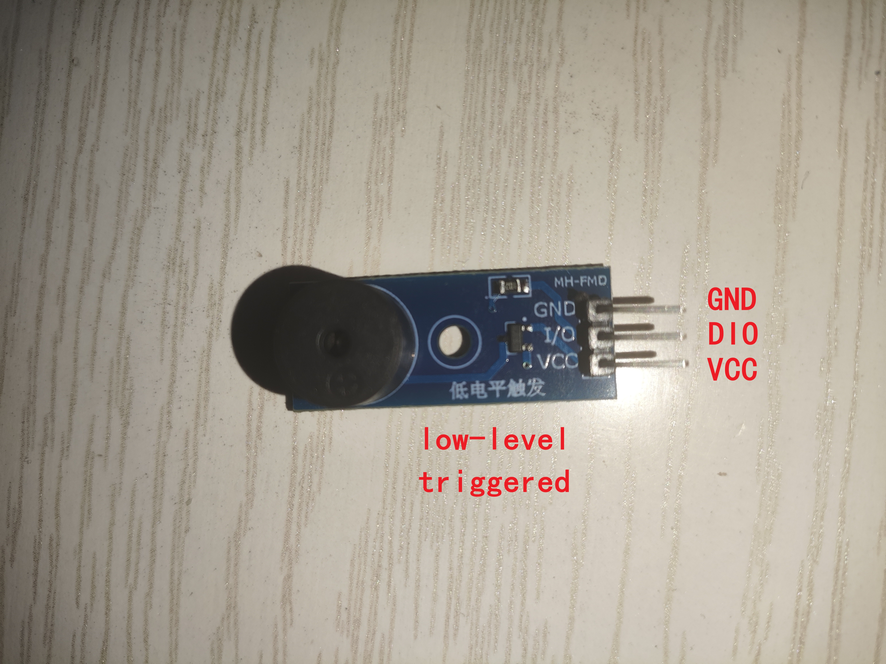

<div align="center">

# GameM-STM32


  
[](LICENSE)  
一个基于STM32F103C8的简易游戏机实现。
</div>

---
## 目录
- [项目简介](#项目简介)
- [项目功能](#项目功能)
- [快速开始](#快速开始)
    - [硬件平台](#硬件平台)
    - [硬件连接](#硬件连接)
    - [软件获取](#软件获取)
    - [软件烧录](#软件烧录)
    - [软件运行](#软件运行)
- [使用说明](#使用说明)
- [开发环境与项目结构](#开发环境与项目结构)
- [致谢](#致谢)
- [许可证](#许可证)
    - [第三方库代码与版权归属](#第三方库代码与版权归属)
## 项目简介
**GameM-STM32** 是一个嵌入式系统课程设计项目。项目以 **STM32F103C8T6** 微控制器为核心，独立搭建了一套完整的便携式游戏硬件平台，并在其上实现了经典的俄罗斯方块游戏逻辑。旨在通过实践，综合运用嵌入式开发中的 GPIO 控制、定时器中断、PWM 输出、SPI 通信以及外设驱动等核心技术。
- **项目背景**：俄罗斯方块是电子游戏史上的经典之作，其规则简单但逻辑严谨，非常适合作为嵌入式系统的练手课题。通过本次设计，将软件算法与硬件电路相结合，亲手打造一台“从零开始”的游戏机。
- **项目目标**：在 STM32F103C8T6 上完整实现俄罗斯方块的核心玩法，包括方块的生成、移动、旋转、消除以及游戏状态管理，并通过 TFT 彩屏和蜂鸣器提供流畅的视觉与听觉反馈。
## 项目功能
- **游戏操作**：利用**四个方向键**（上、下、左、右）和**一个功能键**，支持：
    - 左右移动方块
    - 左右旋转方块（左旋 / 右旋）
    - 加速下落（软降）
    - 方块直接落底（硬降）
    - 暂存当前方块（Hold 功能）
- **游戏机制**：
    - 随机生成 7 种标准方块（I、O、T、S、Z、J、L）
    - 行满消除
    - 以 **60 帧逻辑帧** 稳定运行，操作响应灵敏
- **显示系统**：采用 **ST7735S** 驱动的 **1.8 英寸 128×160 RGB TFT 屏幕**，通过 SPI 接口与 MCU 通信，实时刷新游戏画面。
- **音频反馈**：利用定时器产生 **PWM 波驱动蜂鸣器**，上电后自动循环播放经典游戏音乐《货郎（Korobeiniki）》。
- **电源与硬件**：整体电路在面包板上搭建，通过杜邦线连接各模块，方便调试与扩展。上电后游戏自动启动，无需额外操作。
## 快速开始
### 硬件平台
| 组件 | 型号 / 规格 | 用途 |
| :---: | :--- | :--- |
| 核心板 | STM32F103C8T6 最小系统板（Blue Pill） | 游戏逻辑与整体控制 |
| 显示屏 | 1.8寸 128x160 RGB TFT（驱动芯片 ST7735S） | 游戏画面渲染 |
| 音频输出 | 无源蜂鸣器模块（PWM驱动） | 播放音乐与音效 |
| 按键输入 | 4个方向键+1个功能键（轻触开关） | 用户交互 |
| 供电 | ST-Link 直出3.3V / 核心板 USB 接口 | 系统供电 |
| 连接与搭建 | 面包板 + 杜邦线 | 原型验证与调试 |
> **说明**：  
本项目仅对以上表格中的组件进行过测试（下同），有能力可自行选择替代方案。
### 硬件连接
项目整体一览

`外设引脚` -> `核心板引脚` ( `引脚宏定义` )
1. 显示屏（SPI 通信）
    - `SCL` -> `PA5` ( `SCREEN_CLK` )
    - `SDA` -> `PA7` ( `SCREEN_DT` )
    - `RST` -> `PA2` ( `SCREEN_RST` )
    - `DC` -> `PA6` ( `SCREEN_DC` )
    - `CS` -> `PA4` ( `SCREEN_CS` )
    - `BLK` -> `PA3` ( `SCREEN_BK` )
    
2. 按键（芯片 GPIO 已配置为上拉，无需外接上/下拉电阻）
    - `UP` -> `PB13` ( `BUTTON_up` )
    - `DOWN` -> `PB1` ( `BUTTON_down` )
    - `LEFT` -> `PB11` ( `BUTTON_left` )
    - `RIGHT` -> `PB10` ( `BUTTON_right` )
    - `A` -> `PB12` ( `BUTTON_a` )
3. 蜂鸣器（PWM 控制）
    - `DIO` -> `PA8` ( `AUDIO_PWM` )
    
4. 电源与调试  
    - 可使用 ST-Link 进行调试
    - 可使用 ST-Link 3.3V 输出供电或使用 USB 供电
    > **注意**：不要同时接 ST-Link 3.3V 输出和 USB
### 软件获取
本项目源码托管在 GitHub，你可以通过以下两种方式（推荐自行编译）获得可执行文件：
1. 下载  
访问 [Release](https://github.com/Youning5031/GameM-STM32/releases/latest) 页下载最新版本 HEX 格式固件，适用于希望避免进行复杂环境搭建的用户。  
2. 自行编译  
    使用以下命令获取源码：
    ```
    git clone --recurse-submodules https://github.com/Youning5031/GameM-STM32.git
    cd GameM-STM32
    ```
    本项目采用 **CMake** 构建系统，并依赖 **gcc-arm-none-eabi** 工具链，详见[开发环境与项目结构](#开发环境与项目结构)章节。作者在开发中使用 STM32CubeIDE for VS Code 插件进行一键编译，该插件内置了完整的工具链捆绑包，无需手动安装和配置环境变量。  
    - 操作步骤：使用 VS Code 打开项目根目录，等待插件自动识别项目配置，然后点击左下角状态栏的`生成`按钮即可完成编译。编译卡住可以先停止编译，然后按快捷键 `CTRL + SHIFT + P` 打开命令栏，输入`Cmake: Clean Rebuild` 清理重新编译。
    - 生成的固件：编译后的 .elf 文件通常位于 build/Debug 或 build/Release 目录下，可自行转换为 .hex 格式。
    - 纯命令行环境：若您希望脱离插件手动编译，需自行安装 arm-none-eabi-gcc 和 CMake，但作者未对该方式进行测试，建议优先使用上述插件方案。
### 软件烧录
作者使用 ST-Link 调试器 配合 VS Code 插件完成烧录，操作非常简单：  
- 使用杜邦线将 ST-Link 的 SWDIO、SWCLK、GND 连接至核心板对应引脚（建议连接 3.3V 供电，但注意不要与 USB 同时供电）。  
- 在 VS Code 的运行和调试页面，点击开始调试，插件将自动进行编译并将固件下载至芯片 FLASH 中，烧录完成后自动复位运行。  
- 如果您从 Release 页面下载了独立的 .hex 文件，也可以使用 STM32CubeProgrammer 等通用烧录软件进行写入，具体操作请参考该软件的官方手册。
### 软件运行
本项目上电即自动运行，无需任何额外操作。
- 游戏画面会直接显示在 TFT 屏幕上，同时蜂鸣器响起经典《货郎》旋律。
- 若画面未出现，可按一下核心板上的 RESET 按键手动复位。
## 使用说明
键位定义如下：
- 左移 - 左键
- 右移 - 右键
- 左旋转 - A 键 + 左键
- 右旋转 - A 键 + 右键
- 加速下降 - 下键
- 立即落地 - A键 + 下键
- 方块暂存与恢复 - 上键
- 游戏结束再来一局 - A 键
## 开发环境与项目结构
作者使用 [Visual Studio Code](https://code.visualstudio.com/) 进行开发，安装 [STM32CubeIDE for Visual Studio Code 插件](https://marketplace.visualstudio.com/items?itemName=stmicroelectronics.stm32-vscode-extension)（由 STMicroelectronics 提供）进行项目管理和构建，采用插件默认配置和捆绑包。  
项目结构说明如下：
- [`Core/`](Core/)：软件入口及初始化代码。
- [`Games/`](Games/)：游戏代码。
    - [`Games/Tetris/`](Games/Tetris/)：俄罗斯方块代码。
- [`Drivers/`](Drivers/)：外设驱动代码。
- [`Libs/`](Libs/)：库代码。
- [`tools/`](tools/)：辅助工具
    - [`tools/rotate_cells.py`](tools/rotate_cells.py)：方块坐标旋转预计算脚本。
- [`doc/`](doc/)：项目文档。
    - [`doc/data_calculation.xlsx`](doc/data_calculation.xlsx)：音频PWM寄存器计算表。
## 致谢
感谢我的嵌入式课程授课老师及微处理器与控制器课程设计导师 T。  
感谢 [Arduboy2_stm32](https://github.com/lambda-zhang/Arduboy2_stm32) 提供选题灵感。  
感谢 [ST7735S-STM32](https://github.com/maudeve-it/ST7735S-STM32) 和 [stm32-st7735](https://github.com/STMicroelectronics/stm32-st7735) 提供的屏幕初始化思路。  
游戏背景音乐《货郎》简谱来自[人人钢琴网](https://www.everyonepiano.cn/Number-3999-1.html)。
## 许可证
本仓库整体采用 [**MIT License**](LICENSE) 开源。
### 第三方库代码与版权归属
本项目依赖或包含由第三方机构提供的源代码，这些代码分别受其各自的版权和许可证约束，请务必加以区分：
- 包含 **STM32 HAL 驱动库**，位于 [`Drivers/STM32F1xx_HAL_Driver/`](Drivers/STM32F1xx_HAL_Driver/) 目录，版权归 STMicroelectronics 所有，遵循 **BSD-3-Clause** 许可证。完整的许可条款请查阅该目录下的[许可证文件](Drivers/STM32F1xx_HAL_Driver/LICENSE.txt)。
- 包含 **CMSIS (Cortex-M 软件接口标准)**，位于 [`Drivers/CMSIS/`](Drivers/CMSIS/) 目录，版权归 ARM Limited 所有，遵循 **Apache License 2.0** 许可证。完整的许可条款请查阅该目录下的[许可证文件](Drivers/CMSIS/LICENSE.txt)。
- 通过 Git 子模块引入 [**Magic Enum**](https://github.com/Neargye/magic_enum.git)， 位于 [`Libs/magic_enum/`](Libs/magic_enum/) 目录，遵循 **MIT License** 许可证。完整的许可条款请查阅该仓库的[许可证文件](https://github.com/Neargye/magic_enum/blob/master/LICENSE)。
> 使用本项目即表示您同意并遵守上述**所有**第三方库的许可证条款。
